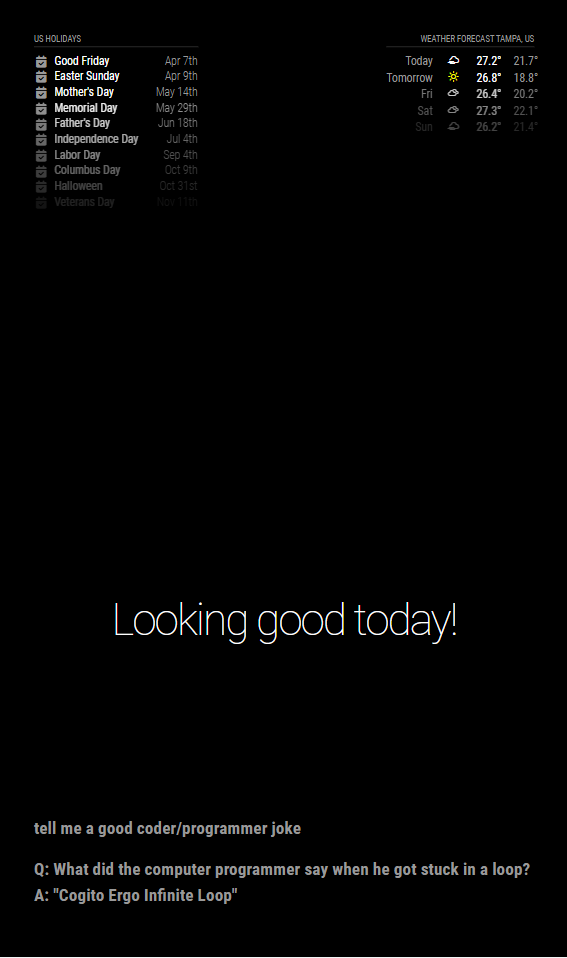

# MMM-spectraAI
Spectra AI is a module application that is designed to integrate with MagicMirror, an open-source smart mirror platform. It allows users to interact with OpenAI's powerful language model, GPT, by hardcoding a prompt, sending it to the OpenAI API, and then displaying the result on the smart mirror.

## Requierments
This module is to be used with the MagicMirror project, so it assumes you have a working MagicMirror set up and running already. There is a great community for this project on places like Reddit and also the [MagicMirror](https://github.com/MichMich/MagicMirror) Forums if you need help with getting started. There is also great [documentation](https://magicmirror.builders/) if you'd like to get started building your own module.

## SET UP Windows:
To get the MagicMirror software running on Windows, you have to do two things in addition to the steps above:

* Download the stable version of Node.js: https://nodejs.org/en/

* Clone the latest MagicMirror code from: https://github.com/MichMich/MagicMirror

* Navigate inside the MagicMirror folder

```bash
 cd MagicMirror
```
* Install dependencies in the vendor and font directories:

Powershell:
```Powershell
cd fonts; npm install; cd ..
cd vendor; npm install; cd ..
```

Command Prompt:
```Powershell
cd fonts && npm install && cd ..
cd vendor && npm install && cd ..
```

Otherwise the screen will stay black when starting the MagicMirror.

* Fix the start script in the package.json file:

Navigate to the file package.json
Find where it says
```javascript
"start": "DISPLAY=\"${DISPLAY:=:0}\" ./node_modules/.bin/electron js/electron.js",
"start:dev": "DISPLAY=\"${DISPLAY:=:0}\" ./node_modules/.bin/electron js/electron.js dev",
```

and replace it with
```javascript
"start": ".\\node_modules\\.bin\\electron js\\electron.js",
"start:dev": ".\\node_modules\\.bin\\electron js\\electron.js dev",
```
Otherwise the program won't start, but will display this error message: "'DISPLAY' is not recognized as an internal or external command, operable program or batch file."

## Set up PI 
* Download the stable version of Node.js: https://nodejs.org/en/

* Clone the latest MagicMirror code from: https://github.com/MichMich/MagicMirror

* Navigate inside the MagicMirror folder

```bash
 cd MagicMirror
```

Install MagicMirror dependencies
```bash
sudo npm install
```
Verify it starts
```bash
npm start
```

Navigate out of the MagicMirror folder
```bash
cd ..
```
Navigate into your MagicMirror's modules
```bash
cd MagicMirror/modules
```
Clone this repository (MMM-SpectraAI)
```bash
https://github.com/nimius-debug/MMM-spectraAI
```
```bash
npm start
npm run start:dev
```
## Config
Open your config file in config/config.js and add the module to the modules array like so:
```javascript
modules: [
    ...Other Modules Here...,
    {
        module: 'MMM-spectraAI',
        position: "bottom_left",
            //optional config 
            config: {
                OPENAI_API_KEY: "YOUR API KEY",
                DEEPGRAM_API_KEY: "YOUR API KEY",
                DG_ENDPOINT: 'wss://api.deepgram.com/v1/listen',
            //   updateInterval: 60 * 60 * 1000, // update every hour
            },
    }
]
```
